#  Edu Assist - AI-Powered Peer Learning Platform


An intelligent peer-to-peer learning platform that leverages AI to assess student performance, match learners with peer tutors, and generate personalized learning roadmaps. Built for Grade 6-12 students covering Mathematics, Science, and English.

##  Key Features

### 📊 **AI-Powered Assessments**
- RAG (Retrieval Augmented Generation) based question generation using FAISS vector search
- Grade-appropriate adaptive assessments across Math, Science, and English
- Chapter-level performance tracking with weakness detection
- Mistral AI evaluation with detailed feedback on open-ended responses
- Real-time progress visualization with subject and chapter breakdowns

###  **Smart Peer Matching**
- Automatic tutor-learner pairing based on complementary strengths/weaknesses
- Location-aware matching (physical meetings with GPS coordinates)
- Chapter-specific expertise matching
- Dual-role support: students can be tutors in strong areas and learners in weak areas
- Meeting preferences: online, physical, or hybrid

###  **Personalized Learning Roadmap**
- AI-generated chapter-specific study plans
- Priority-based learning sequences (severe → moderate → mild weaknesses)
- Practical examples and recommended resources
- Estimated study time and milestone tracking
- Auto-regenerates based on latest assessment performance

###  **Performance Analytics**
- Overall subject proficiency scores (0-100%)
- Chapter-level weakness levels: severe, moderate, mild, none
- Historical assessment tracking
- Fit-to-teach level calculation (determines tutoring eligibility)
- Recent activity feed

###  **User Management**
- Secure JWT-based authentication
- Role-based access: student, teacher, admin
- School-based organization
- Profile management with grade level tracking

---


## UI Screenshots

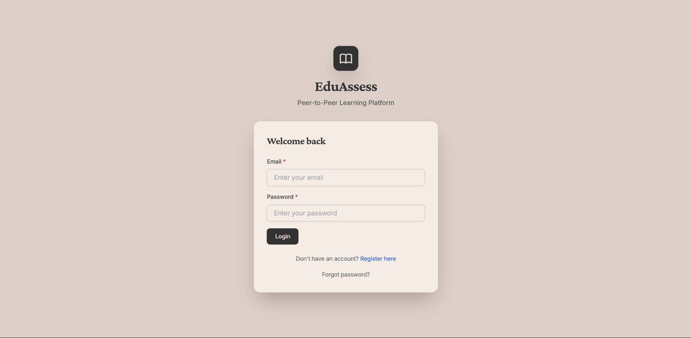
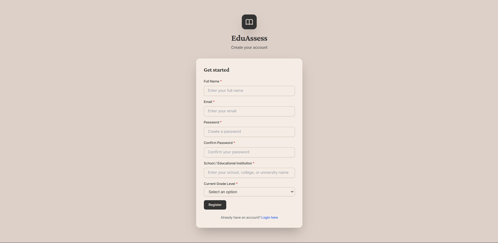
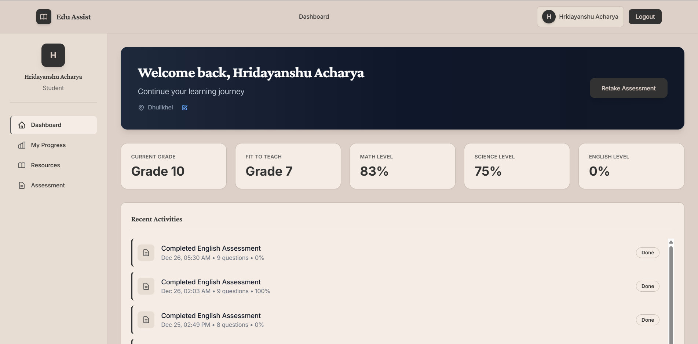
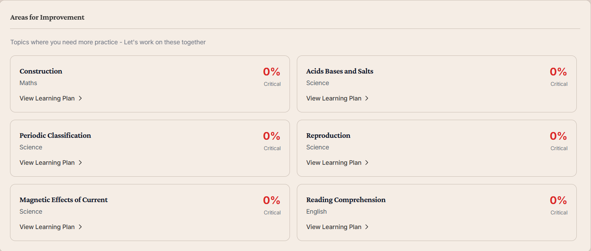
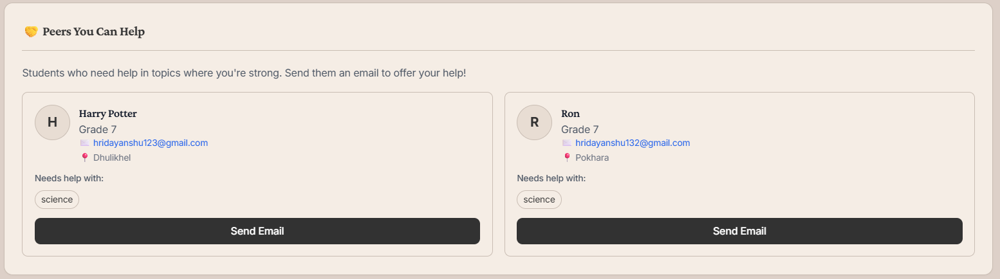
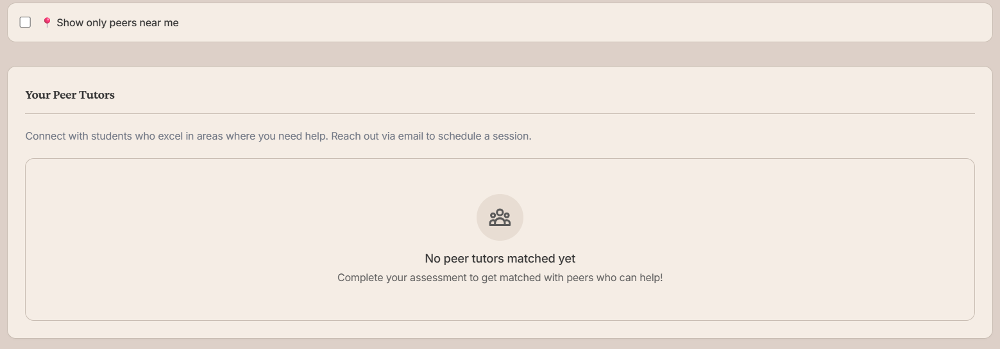
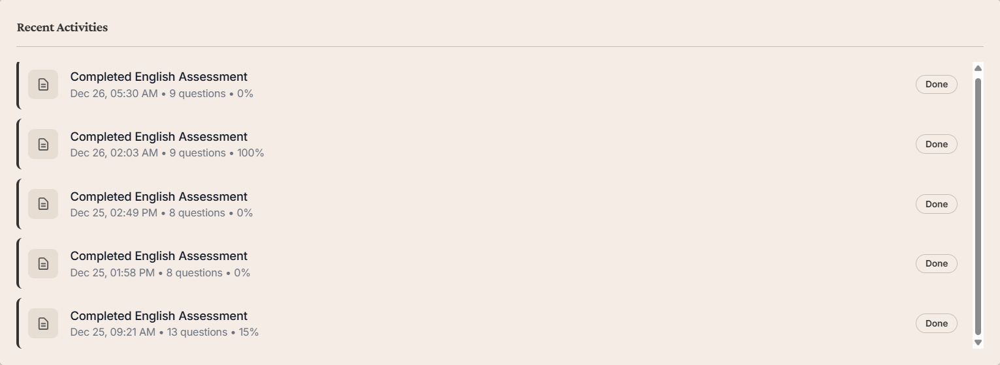
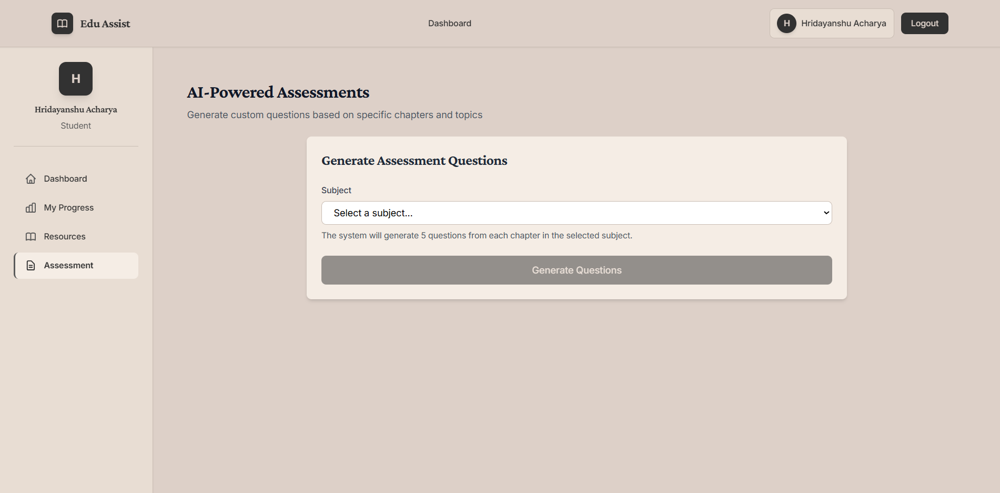
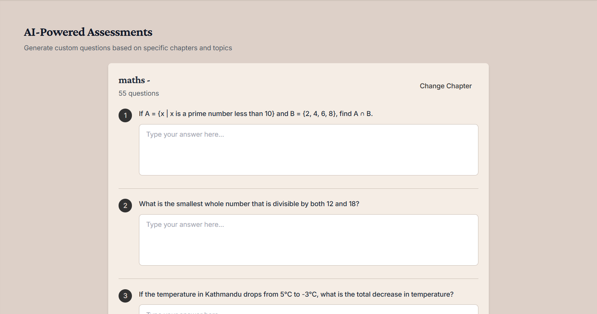

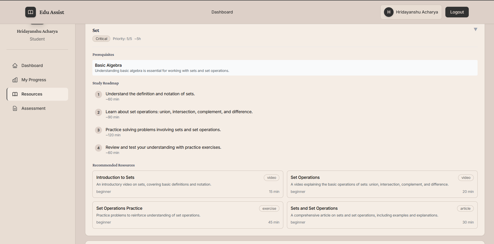
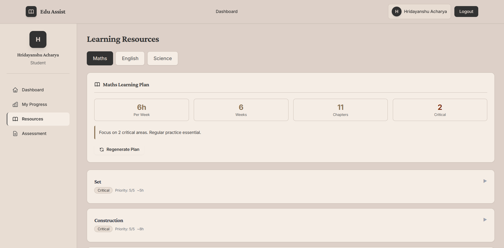
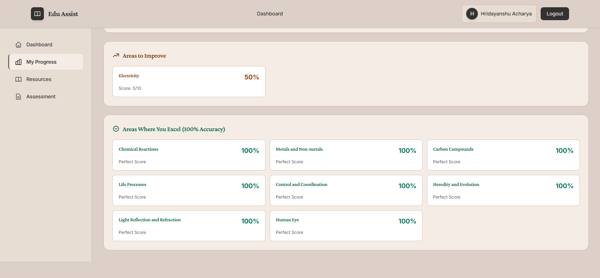

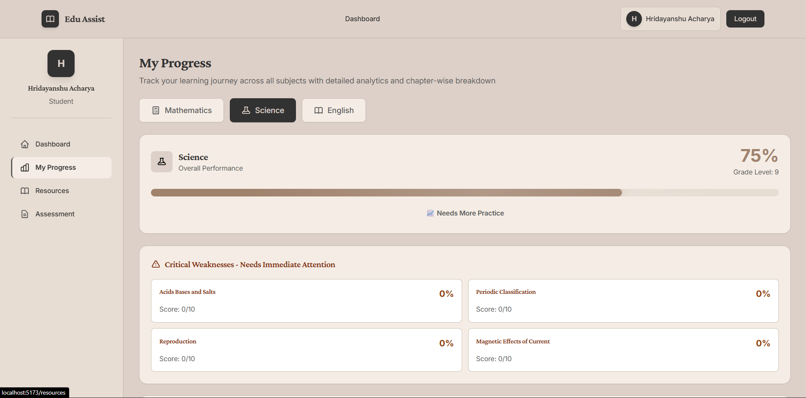


---

##  How It Works

### 1. **Assessment Flow**
```
Student takes assessment → RAG generates questions from knowledge base
→ Mistral AI evaluates responses → Chapter-level performance recorded
→ Weakness levels calculated (severe/moderate/mild)
→ Subject proficiency updated
```

### 2. **Peer Matching Algorithm**
```
For each student:
  - Calculate average scores per subject/chapter
  - Identify: Can tutor (score ≥ 7/10) or Needs help (score < 10/10)
  - Find complementary peers in same location/school
  - Match based on overlapping chapters
  - Display needs_help_with: chapters where learner is weak & tutor is strong
```

### 3. **Learning Roadmap Generation**
```
Fetch student's weak chapters → For each chapter:
  - Query Mistral AI for personalized study plan
  - Include: key concepts, strategies, practice problems, resources
  - Priority: severe (0-3/10) → moderate (4-6/10) → mild (7-8/10)
→ Generate global recommendations (study hours, timeline)
→ Store in database with 30-day expiry
```

---

##  Technology Stack

### Backend
- **FastAPI** - Modern Python web framework
- **SQLAlchemy** - ORM for database operations
- **SQLite** - Lightweight database
- **Pydantic** - Data validation
- **Mistral AI** - LLM for question evaluation and learning materials
- **FAISS** - Vector similarity search for RAG
- **scikit-learn** - Embeddings and ML utilities
- **Python-JOSE** - JWT authentication

### Frontend
- **React 19** - UI library
- **Vite** - Build tool
- **TanStack Query** - Data fetching/caching
- **Zustand** - State management
- **React Router** - Navigation
- **Axios** - HTTP client
- **Recharts** - Data visualization
- **Tailwind CSS** - Styling
- **Lucide React** - Icons

---


##  Contributing

1. Fork the repository
2. Create a feature branch (`git checkout -b feature/AmazingFeature`)
3. Commit your changes (`git commit -m 'Add some AmazingFeature'`)
4. Push to the branch (`git push origin feature/AmazingFeature`)
5. Open a Pull Request

---


##  License

This project is part of the Hackstreet Bois's Hackfest 2025 project.

---

##  Team

**Hackstreet Bois** - Building the future of peer-to-peer education  

### 👨‍💻 Contributors
- **Hridayanshu Raj Acharya**  
  🔗 https://github.com/hridayanshu236

- **Bhism Pd. Bhandari**  
  🔗 https://github.com/DontHash

- **Akash Kafle**  
  🔗 https://github.com/Akash-kafle

- **Suman Khatri**  
  🔗 https://github.com/sumankhatri17

---
